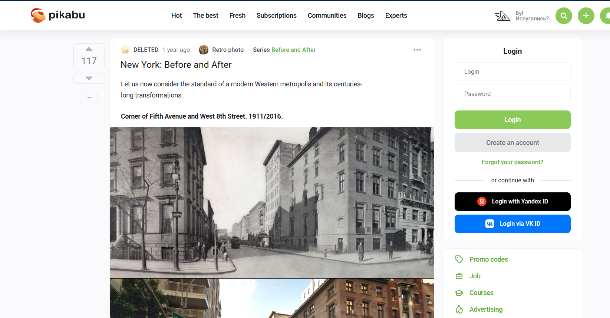
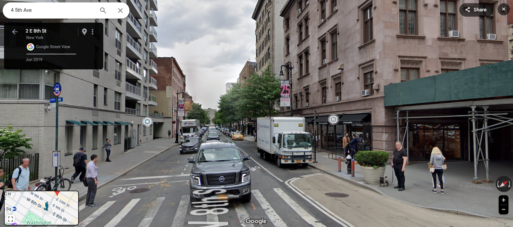
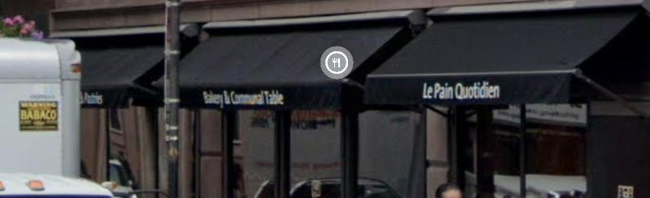

### **Challenge Name: OSINT 100 - Who Can It Be Now**

---

### **Description**

A trip through time through the power of open-source intelligence! Start by finding the location in this image:

Boy, I bet it's changed a lot in a century or so. You should find out. If you do, you'll see a business on the corner with a rustic chic style. Convert the words on the awning closest to the intersection into a flag using the alphabet in the rules and accept your daily bread. (i.e. poctf{uwsp_ _ _ })

---

Got it! Here's the refined version of your **Approach** section:  

---

Understood! Here's the updated version of the **Approach** section, retaining the mention of images for context:  

---

### **Approach**

1. **Reverse Image Search:**  
   - Performed a reverse image lookup on the provided photo and found an exact match on a website comparing historical and modern views of the location.  
   - **Reference:**  
       

2. **Identify the Street:**  
   - Searched for the street using Google Images to confirm the location and its current appearance.  
   - **Reference:**  
       

3. **Locate the Awning:**  
   - Inspected the image for an awning closest to the intersection, as per the challenge hint, and identified the shop's name.

4. **Extract the Text:**  
   - Found the text "Le Pain Quotidien" on the awning.  
     

5. **Flag Formatting:**  
   - Applied the rules to format the text into the flag format: `poctf{uwsp_l3_p41n_qu071d13n}`.  

---

### **Flag**

`poctf{uwsp_l3_p41n_qu071d13n}`

---