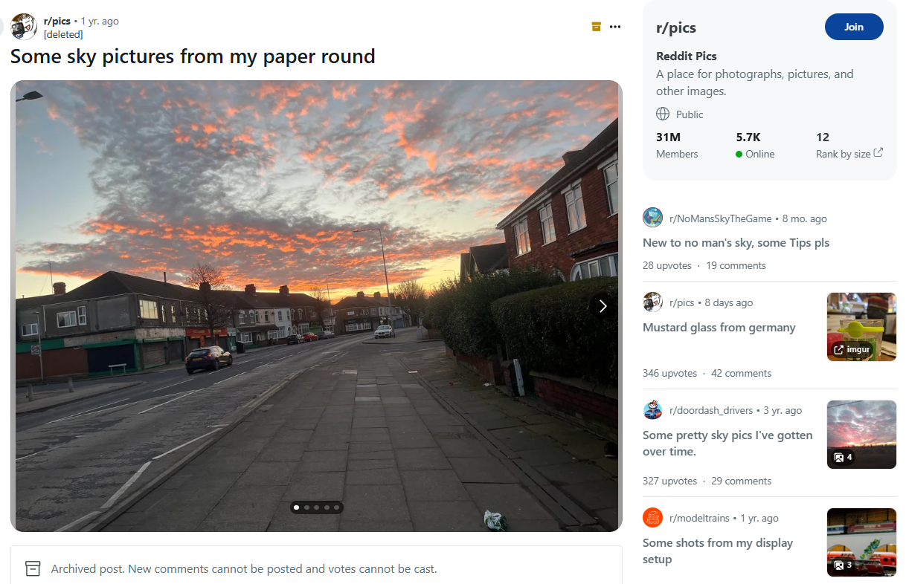
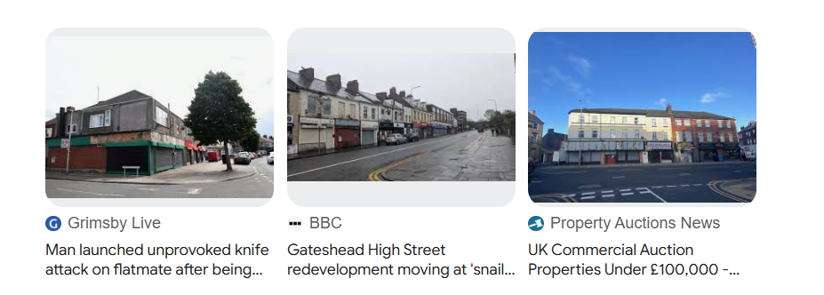
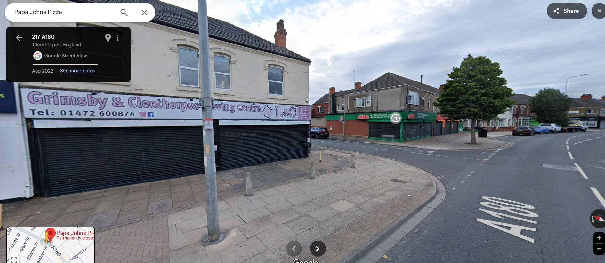

## **Challenge Name: OSINT 200 - A Tangle A Jingle**

---

### **Description**

Sometimes I like to try to find the exact location where a photo was taken. A little OSINT exercise I do sometimes to keep my skills sharp. This image was posted to a social media platform last year. I was able to find where it was taken, and if you can too then you will see that there is a business just out of frame, across the street from the building on the corner, to the left of the bollards. The phone number on their sign is the password to the archive (no spaces or special characters.)

#### **File Provided**  
- [OSINT200-2.zip](Resources/OSINT200-2.zip)

---

### **Approach**

1. **Initial Reconnaissance and Reverse Image Lookup**  
   - The given image was used in a reverse image lookup, leading to a Reddit post with related images.  
   - These images provided different angles of the same location but no conclusive details initially.

   

2. **Tweaking Reverse Image Lookup**  
   - By isolating parts of the image, I focused on the distinct architectural features of the building in the background.  
   - This led to an article mentioning a former **Papa John's takeaway** on **Grimsby Road**.  

   

3. **Pinpointing the Location**  
   - The article mentioned incidents near the **Papa John's** on **Grimsby Road**.  
   - Searching for this location on Google Maps and using Street View revealed the exact spot.  

   

4. **Finding the Phone Number**  
   - Using Street View, I located the business across the street to the left of the bollards.  
   - The phone number displayed on the sign was noted as the password.  

   

5. **Unlocking the Archive**  
   - Entering the phone number (without spaces or special characters) successfully unlocked the ZIP archive, revealing the flag.

---

### **Flag**

`poctf{uwsp_1_h4v3_4_dr34m}`

---