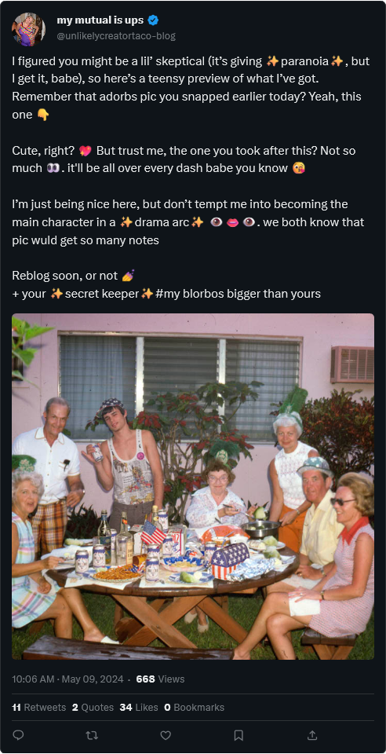
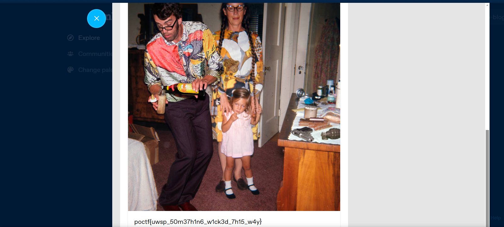

## **Challenge Name: OSINT 200 - Grifting Lonesome Widowers**
---

### **Description**

You don't get to where I am without making a few enemies. I've had to climb over a lot of heads to reach the mountaintop. I'm referring, of course, to my 2021 win at the $2,500 No-Limit Deuce to Seven Draw Tournament at the World Series of Poker in Vegas. So yeah, I'm pretty good at poker.

Well, when people can't take you down a peg or two at the table, they're going to try to get you another way. That's me, though. It's the only way they'll get me, because I know when to hold'em and when to fold'em. So I wasn't surprised when I saw this message posted at me. No idea who this person is, but this pic is from the last 4th of July BBQ. That's me and the missus right there.

To be honest, I don't remember much about this day after this picture was taken. The Tito's was a-flowing and I had a couple-three mocktails on top of that. All I know is I checked my camera roll the next morning, and let's just say if there's even a chance that this person has any of the other pics then I'm scared. They might be airballing, but I can't go all in on that.

Get out there and prove this donkey's just clicking buttons with this bluff.

NOTE: Photo credit goes to David LaChapelle Recollections in America. CBIR will not help you.

---

### **Approach**

Kevin Malone - 2,500$ win line from the office reference.

Know when to hold'em and when to fold'em - This is a reference to the famous line from the song "The Gambler" by Kenny Rogers

Characteristic of the person - The Tito's was a-flowing and I had a couple-three mocktails on top of that. 

Tito's - Made in Austin, Texas.

I figured you might be a lil' skeptical (it's giving paranoia, but I get it, babe), so here's a teensy preview of what I've got. Remember that adorbs pic you snapped earlier today? Yeah, this one
Cute, right? But trust me, the one you took after this? Not so much. it'll be all over every dash babe you know
I'm just being nice here, but don't tempt me into becoming the main character in a drama arc. we both know that pic wuld get so many notes
Reblog soon, or not
+ your secret keeper #my blorbos bigger than yours

The language used tells me it's related to tumblr - dashboard, notes, reblog, etc.

Looked up his username - 'unlikelycreatortaco-blog' on tumblr and found his blog.

---

### **Flag**

`poctf{uwsp_50m37h1n6_w1ck3d_7h15_w4y}`

---