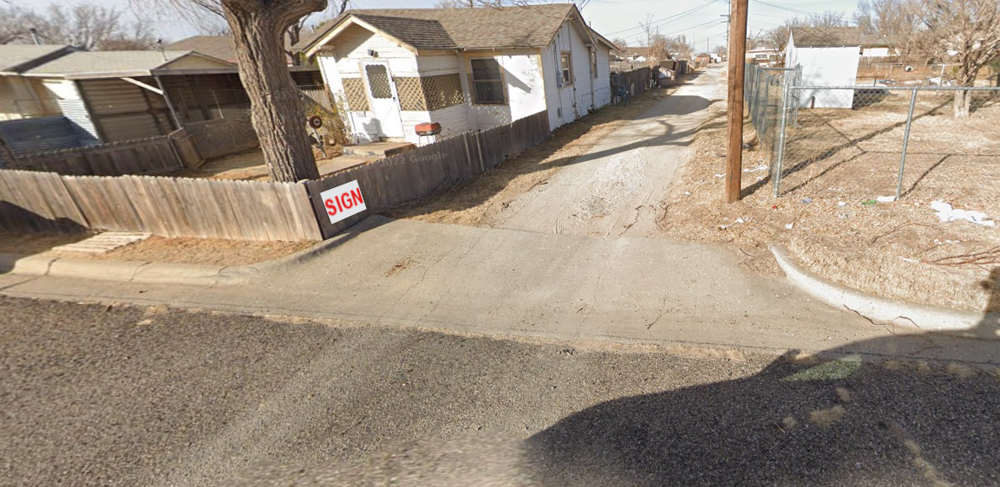
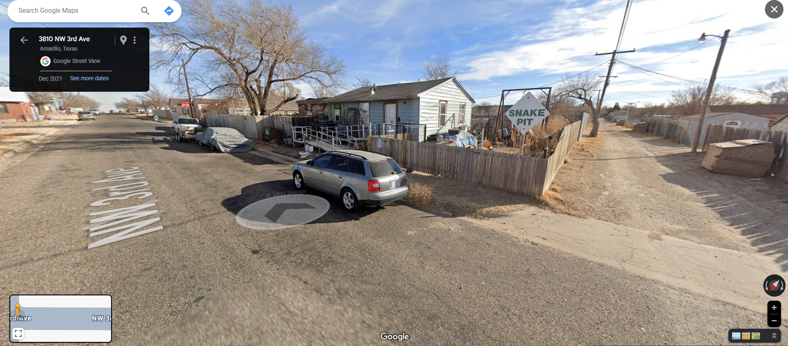

## **Challenge Name: OSINT 200 - A Tangle A Jingle**

---

### **Description**

I have a dynamite idea! Let's go on a little snake hunt. Now, where do you find snakes? That's right, in snake pits! How do you find snake pits? By following the clearly marked signs to the designated snake dumping pit locations, of course! Surely you've seen those around your city, right? They probably look a little like this one:

I'll even give you a little help by zooming out a little. You're not xanthophobic, are you?

You know, while we're here, I'm going to grab a fresh password for the archive that contains the flag. As a memento to remember our hunting expedition. The phone number on the sign back there should do. Numbers only, no parenthesis, no spaces, no dashes.

#### **File Provided**  
- [OSINT200-2.zip](Resources/OSINT200-1_flag.zip)

---

### **Approach**

#### **Step 1: Analyze Image Metadata**
- **EXIF Data:**  
  Extracted EXIF data from the first image revealed critical information:
  - **Hints:**
    1. "There are no snakes in Ireland, so the sign isn't there."
    2. "The sign is written in English, but is not in England."
  - **Coordinates:** `43°46'10.6"N 88°26'29.4"W`  
  Converted to decimal: `43.76961111°, -88.44150000°`.  
  This pinpointed a location near **San Jacinto, Amarillo, Texas**.

#### **Step 2: Locate the Scene**
- Using Google Maps, explored the **San Jacinto** area to match the first and second images.
- Found the **location of the sign** near **3810 NW 3rd Ave**.

#### **Step 3: Explore Nearby for the Phone Number**
- Using **Google Street View**, examined the opposite side of the snake pit sign.
- Found a **phone number** on the back of the sign: `806-340-7320`.

![![image2.png]](Resources/image2.png)

#### **Step 4: Unlock the Archive**
- Entered the phone number (without formatting) as the password: `8063407320`.
- Successfully unlocked the ZIP archive.

---

### **Flag**

`poctf{uwsp_f07r7un3_f4v0r5_7h3_b01d}`

---