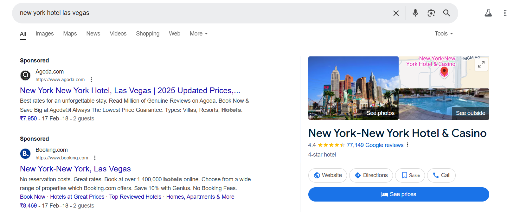

## **Challenge Name: OSINT 300 - Intimidation by Ecolocation**  

---  

### **Description**  

Wasn't last year's multi-part OSINT challenge a blast? Let's do that again! Attached to this challenge is a VeraCrypt container. The password for this container is in three parts and you're going to need to do some searching to assemble them.  

Let's start with this one. The first part of the password is the full name of the cat. Make sure it's capitalized to put some respect on it.  

  

Add a dash (-) to separate the next part, which is the last name of the artist that makes these awesome sculptures. Make sure it's capitalized to put some respect on it.  

  

Add a dash (-) to separate the next part, which is the street number and five-digit zip code of the building where this picture was taken. For example, if the address is 1234 Main St. Nowhere, US 54321-4321 the solution would be 123454321.  

  

#### **File Provided**  
- [OSINT300-3](Resources/OSINT300-3)  

---

### **Approach**  

#### **Step 1: Identifying the Cat's Name**  
- Analyzed the first image:  

    

- Reverse image search identified the person as **Yuri Knorozov**, a prominent scholar.  
- His cat’s full name is **Aspid**. *(Note: "Asya" is its nickname.)*  

---

#### **Step 2: Identifying the Artist**  
- Conducted a reverse image search on the second image:  

    

- Found a Reddit thread mentioning the artist as **Jeff Galewood**.  
- The last name for the password is **Galewood**.  

---

#### **Step 3: Locating the Address**  
- Examined the third image and identified location clues. The placard mentions **New York**, while a notebook nearby includes **Las Vegas**.  

    

- Searched for matching landmarks and identified the location as **3790 S Las Vegas Blvd, Las Vegas, NV 89109**.  
  - From this address, the password part is **379089109**.  

---

### **Final Password**  
Combining the three parts:  
`ASPID-GALEWOOD-379089109`  

---

### **Flag**  
`poctf{uwsp_411_7h3_b357_p30p13}`  

---  