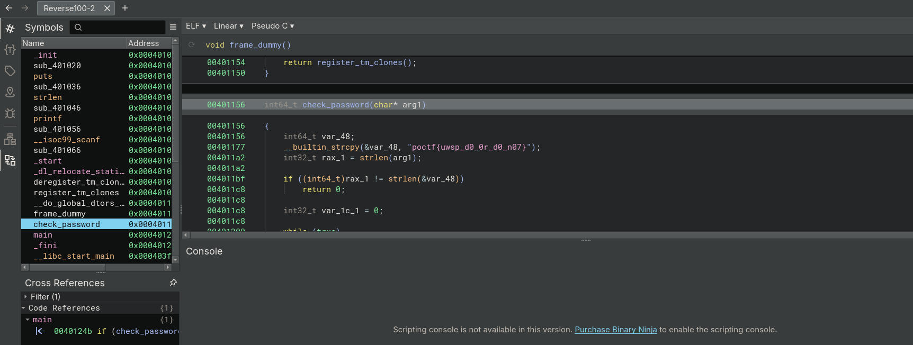

## **Challenge Name: Reverse 100 - End of the Line**  

---

### **Description**  

I got into CTFs a long time ago. Despite that, I remember how tough it was. It seemed impossible to solve all of the challenges. Heck, it seemed impossible to solve one. I remember how intimidating it was, but I also remember how amazing it felt to solve my first challenge and submit my first flag.  

Looking back, it wasn't a tough challenge, but it was a start. Well, here's your chance. This is a recreation of the very first CTF challenge I solved. If you manage to solve this one, just remember that this is where I started, too.  

#### **File Provided**  
- [Reverse100-2](Resources/Reverse100-2)  

---

### **Approach**  

#### **Step 1: Understanding the Binary**  
- Running the binary prompts for a password.  
- To identify the password, we load the ELF file in **Binary Ninja**.  

---

#### **Step 2: Analyzing the Code**  
- In Binary Ninja, reviewing the C pseudocode reveals the following snippet from the main function:  

  ```c  
  00401224        printf(format: "Enter the password: ")  
  0040123f        void var_78  
  0040123f        __isoc99_scanf(format: "%99s", &var_78)  

  00401252        if (check_password(&var_78) == 0)  
  0040126f            puts(str: "Access denied!")  
  00401252        else  
  0040125e            puts(str: "Access granted!")  
  0040125e        

  0040127a        return 0  
  ```  

- The **check_password** function directly compares the input with the flag.  

    

---

### **Flag**  

`poctf{uwsp_d0_0r_d0_n07}`  

---