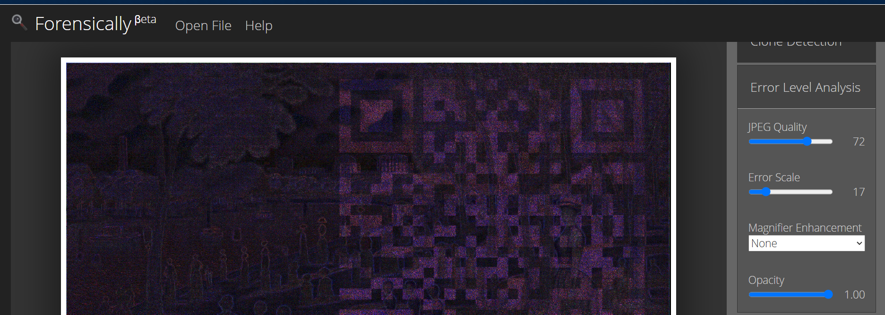
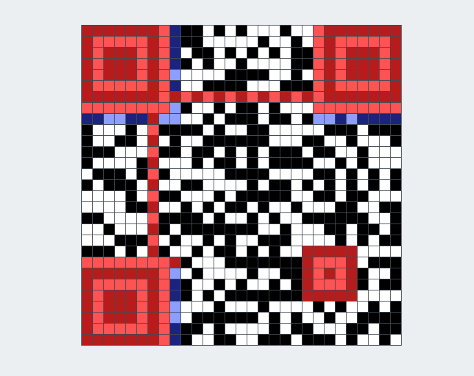
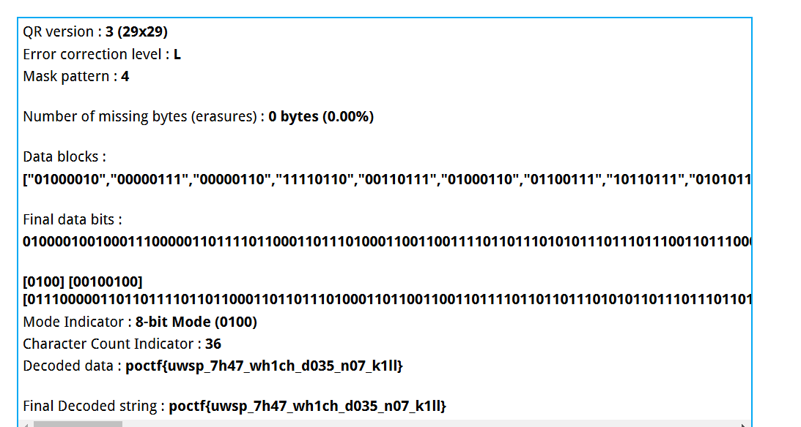

## **Challenge Name: Stego 200 - Little Things Matter the Most**  

---

### **Description**  

In a world of chaos and clutter, it's often the little things that hold the greatest secrets. Little things also tend to add up. I've always thought of the truth as being like Seurat's *A Sunday Afternoon on the Island of La Grande Jatte,* where you get only little dots of truth, but if you get enough of them, you can back up and see the big picture.  

I tried to have AI generate my own version of this, but it is unable to come close to the original. I'm not really surprised, and there is a part of me that is glad that, at least for now, the care and creativity of humans is unassailable.  

**Files Provided:**  
 

---

### **Approach**  

1. **Initial Observations**:  
   - The challenge references *A Sunday Afternoon on the Island of La Grande Jatte*, hinting at a connection to the image's pixel-level details.  
   - The text emphasizes “little things” and “back up and see the big picture,” suggesting something hidden within the image.  

2. **Visual Inspection**:  
   - Compared the provided image to the original painting and noticed distortions in pixels, particularly around animals and figures.  

3. **Steganography Tools**:  
   - Ran the file through common tools like `zsteg` and `stegsolve`, but no clear output emerged.  
   - Opened the image in Forensically to analyze it further.  
   -   

4. **Hexdump Analysis**:  
   - Extracted a hexdump of the file and searched for embedded PNG headers:  
     ```bash  
     grep -abo "PNG" Stego200-2.png  
     ```  
     Result:  
     ```
     1:PNG  
     25667216:PNG  
     31787609:PNG  
     48168936:PNG  
     66542125:PNG  
     ```  
   - Found five PNG headers, with additional ones starting at significant offsets.  

5. **Investigating Embedded Data**:  
   - Extracted each embedded PNG using a hex editor and the offset markers.  
   - Observed parts of a QR code in the extracted images but none were complete or scannable.  

6. **Reconstructing the QR Code**:  
   - Manually recreated the QR code based on the noise pattern using online QR reconstruction tools.  
   -   
   - Scanned the QR code to reveal the flag.  
   -   

---

### **Flag**  

`poctf{uwsp_7h47_wh1ch_d035_n07_k1ll}`  

---  