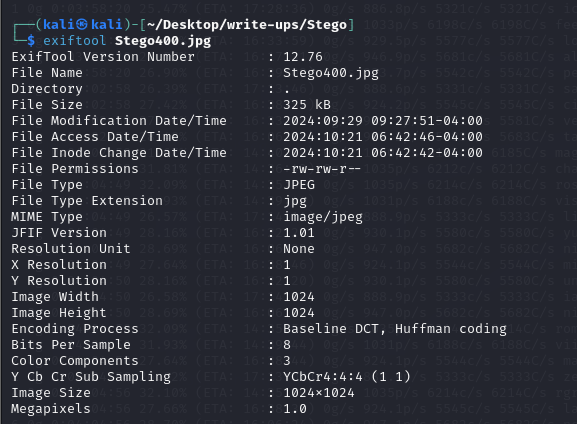
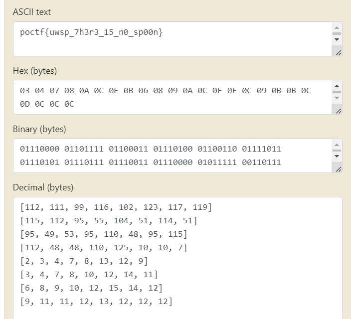

### **Challenge Name: Stego 400 - He Pretends To be A Boor**

---

### **Description** 
Oh my god... Have you seen the things Prof. Johnson hsa been saying in Discord? I'm telling you, the guy is losing it. It's getting worse and worse. I would say the pressure of the contest is getting to him, but it actually started way before the contest. I remember during the summer when we were developing the challenges he burst into the lab one day waving this picture in the air and shouting, "I HAVE IT! DON'T YOU SEE!? IT'S ALL CONNECTED!!" We tried to get him to explain but he just shoved the doors open called back to us with a, "IT'S A GAME WITHIN THE GAME!!"

NOTE: The flag is quite fragile. Make sure your image matches the checksum or it may not be recoverable.

Artifact Files:
* [Image](./Resources/Stego400.jpg)

### **Approach**


After downloading the file, let's check what type of file is it, so we run the `file` command.

```
└─$ file Stego400.jpg 
Stego400.jpg: JPEG image data, JFIF standard 1.01, aspect ratio, density 1x1, segment length 16, baseline, precision 8, 1024x1024, components 3
```

Hmm, so it actually is a JPEG file. So, without wasting any time let us get the metadata of this JPEG file using `exiftool`.

```
└─$ exiftool Stego400.jpg 
```                                        


No special kind of metadata there, let's try `stegseek` using the `rockyou.txt` wordlist.

```
└─$ stegseek Stego400.jpg 
```


After a quick run, stegseek says it couldn't find a valid passphrase.

Let's use `binwalk` to look for any embedded files, inside of the jpeg.
```
└─$ binwalk Stego400.jpg
```


Nothing, just a JFIF, i.e. JPEG file.

Hmm, so after re-looking at the challenge description, we can see the author warn us about the fragility of the JPEG file. This could mean it's somewhat realted to JPEG's file structure.

So, let's use `xxd` to get the hexdump of the file, or use any hexeditor of your choice.

```
xxd Stego400.jpg | less
```


Just after the JFIF tag we can see something of interest, as it looks very similar to the flag format. And, on further verification it can be verified that it's the flag. But, it's in jumbled form and bruteforcing to dejumble would be of very high complexity.

Jumbled Flag - `pos_pct1p057f{h_0nn3uwr0}_3s`

We can also notice that, these values are in the metadata regionof the file, yet `exiftool` didn't detect these values, how so?

If you look closesly, you can see that these values are enclosed between the `ffdb` markers. What are these, let's do a little research on the structure of the JPEG file.

After researching, I found out that these values form what is called the Quantization Tables. These quantization table values are used to determine the level of compression in the Discrete Cosine Transformation Algorithm of JPEGs.

So, let's write up a imple Python script to carve out these Quantization Table values from the JPEGs.

```python
from PIL import Image

def extract_quantization_table(image_path):
    img = Image.open(image_path)
    quant_tables = img.quantization
    
    for table_id, table_data in quant_tables.items():
        print(f"Quantization Table {table_id}:")
        for i in range(0, len(table_data), 8):
            print(table_data[i:i+8])
            
    
    return quant_tables

image_path = 'Stego400.jpg'
quant_tables = extract_quantization_table(image_path)
```


This script extracts and prints out 2 quantization tables, Quantization Table 0 and 1.

Since, we already saw in the hexdump that our flag was present right at the start, we know our value's embedded in table 0. Looks like decimal values, so we modify the script to extract only table 0 and convert each decimal value to ASCII and print.

* [Python Script](./Resources/decode.py)


Or, we can just copy the values from the table and use <a href="https://www.rapidtables.com/convert/number/ascii-hex-bin-dec-converter.html">Rapid Tables</a>.
Paste the values in the decimal field and we have our flag.



### **Flag**

`poctf{uwsp_7h3r3_15_n0_sp00n}`

---